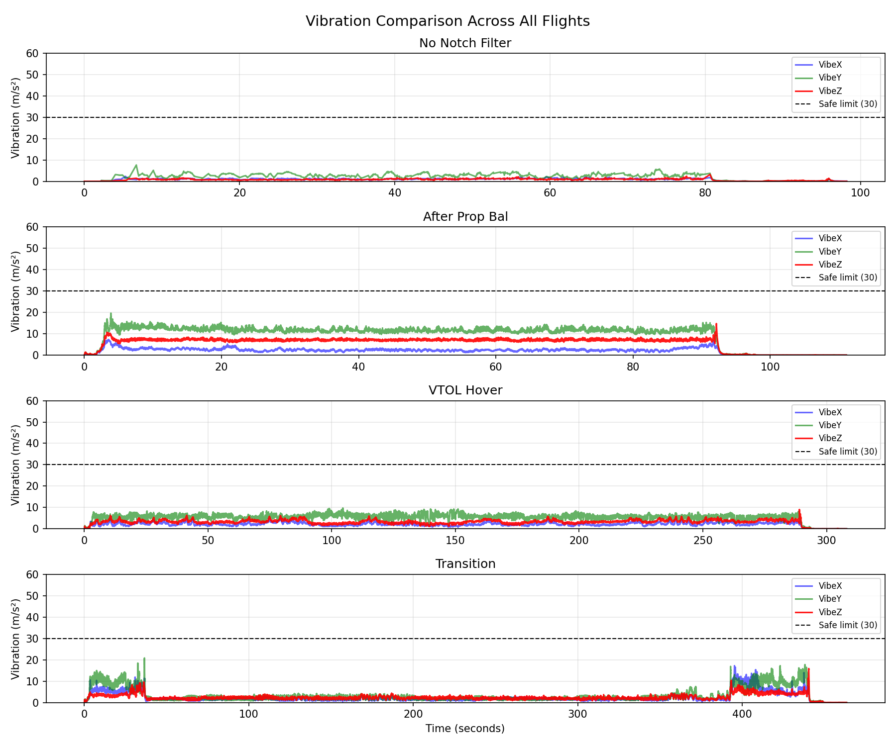
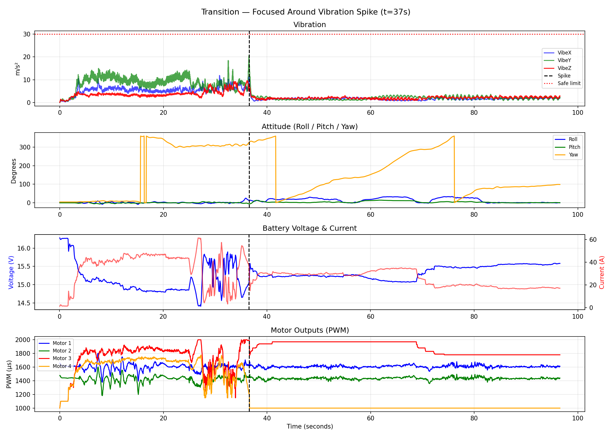

# ArduPilot AI Log Diagnosis Tool

An automated flight log analysis tool that parses ArduPilot `.bin` logs, 
detects anomalies across key subsystems, and generates human-readable 
root-cause diagnosis reports.

## What It Does

- Parses ArduPilot `.bin` flight logs via pymavlink
- Detects anomalies in vibration, battery, motors, and attitude
- Compares multiple flights progressively to find degradation trends
- Generates automated diagnosis reports with root-cause hypotheses

## Real Case Study

Analyzed a **QuadPlane TRI crash** across 4 flight logs.  
Tool correctly identified **Motor 4 failure** as the primary cause:

| Flight | Duration | Motor 4 Status | Verdict |
|--------|----------|----------------|---------|
| Vibe Test (No Notch) | 1.6 min | Normal | Ground test only |
| After Prop Balance | 1.9 min | Cutting out |  First sign of failure |
| VTOL Hover | 5.1 min | Saturating + cutting | Active failure |
| Transition | 7.7 min | Dead (9274 samples) |  Crash |

## Sample Diagnosis Output
```
╔══════════════════════════════════════════════════╗
║      ArduPilot AI Log Diagnosis Report           ║
╚══════════════════════════════════════════════════╝
  File          : transition.bin
  Duration      : 463.6s (7.7 min)

  ANOMALIES DETECTED: 5
  ──────────────────────────────────────────────
    BATTERY INSTABILITY at t=451.9s
    EXTREME ROLL: 47.2° at t=556.4s
    MOTOR SATURATION: Motor 3 — 1489 samples
    MOTOR CUTOUT: Motor 3 — 378 samples
    MOTOR CUTOUT: Motor 4 — 9274 samples

  ROOT CAUSE:
   Motor 4 failure during VTOL to fixed wing transition
   Battery stress from Motor 3 over-compensation
   Motor saturation — aircraft fighting to maintain altitude
```

## Sample Output Plots




## Installation
```bash
git clone https://github.com/[your-username]/ardupilot-log-diagnosis
cd ardupilot-log-diagnosis
pip install -r requirements.txt
```

## Usage
```bash
# Step 1 — Explore what message types are in your log
python explore_log.py

# Step 2 — Extract and analyze key signals
python extract_signals.py

# Step 3 — Compare vibration across multiple flights
python compare_vibes.py

# Step 4 — Generate full automated diagnosis report
python diagnose.py
```

## Scripts

| Script | Purpose |
|--------|---------|
| `explore_log.py` | Reads a .bin file and lists all message types and counts |
| `extract_signals.py` | Extracts vibration, battery, and attitude signals and prints analysis |
| `compare_vibes.py` | Compares vibration levels across multiple flights and plots results |
| `diagnose.py` | Runs full anomaly detection and prints root-cause report |

## Built For

GSoC 2026 — ArduPilot  
Project: AI-Assisted Log Diagnosis & Root-Cause Detection

## Author

Sathvik  
B.Tech ECE — Vignana Bharathi Institute of Technology (JNTUH)  
IEEE Publication: Vocal Lens — Accepted & Presented at IEEE ICoECIT 2026